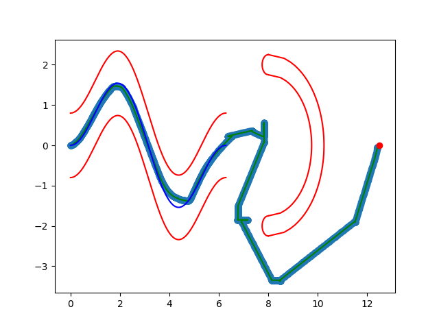

# Sahayak Bot

## Project Description
- **Implemented pick-and-place task** using MoveIt (Rviz, Gazebo).
- **Mapping and navigation solution** for autonomous robot navigation.
- A **Mobile Robot** equipped with a UR5 robotic arm capable of autonomously navigating and carrying items across office rooms.
- Developed as part of the **e-Yantra Robotics Competition (eYRC) 2020**, an international robotics challenge organized by IIT Bombay.

---

## Demonstrations

### 1. Obstacle Avoidance and Sinusoidal Movement

- Visual representation of the robot's ability to avoid obstacles while following a sinusoidal path.
- This showcases advanced path-planning algorithms integrated into the robot's control system.

### 2. Mapping and Navigation

- This video demonstrates the mapping and navigation capabilities of the robot.
- [Watch on YouTube](https://www.youtube.com/watch?v=nRCZaozm6M4)

---

### 3. Pick-and-Place Task

- Demonstrates the robot successfully executing a pick-and-place task with 3 objects.
- [Watch on YouTube](https://www.youtube.com/watch?v=Rp0N2W_GN8I)

---

## Acknowledgments
This project was conceptualized and executed as part of the **e-Yantra Robotics Competition (eYRC) 2020**, an initiative by **IIT Bombay** to promote robotics and automation among engineering students globally.
