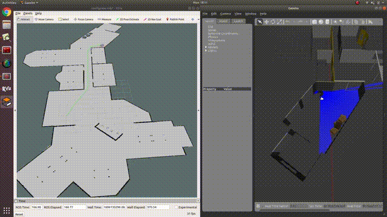
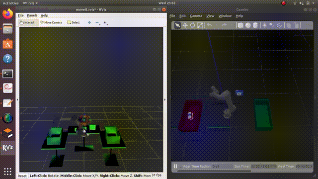

# Sahayak Bot

## Project Description
- **Implemented pick-and-place task** using MoveIt (\textit{Rviz, Gazebo}).
- **Mapping and navigation solution** for autonomous robot navigation.
- A **Mobile Robot** equipped with a UR5 robotic arm capable of autonomously navigating and carrying items across office rooms.

---

## Demonstrations

### 1. Mapping and Navigation

- This video demonstrates the mapping and navigation capabilities of the robot.
- [Watch on YouTube (6:40 - 7:00)](https://www.youtube.com/watch?v=nRCZaozm6M4)

---

### 2. Pick-and-Place Task

- Demonstrates the robot successfully executing a pick-and-place task with 3 objects.
- [Watch on YouTube (1:25 - 1:45)](https://www.youtube.com/watch?v=Rp0N2W_GN8I)
